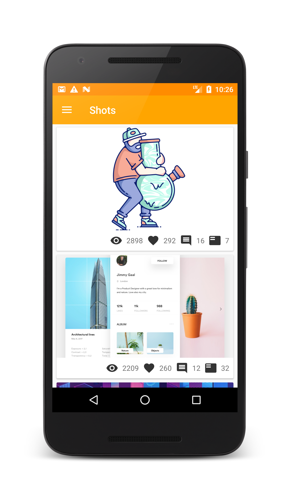
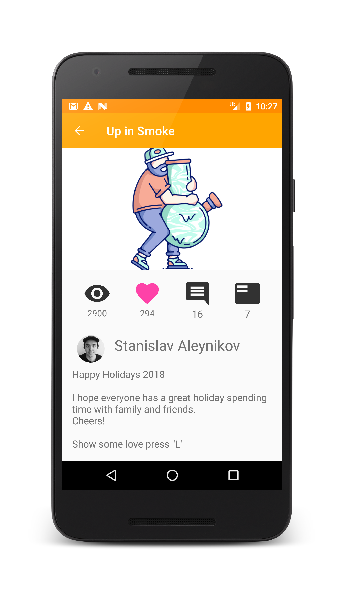
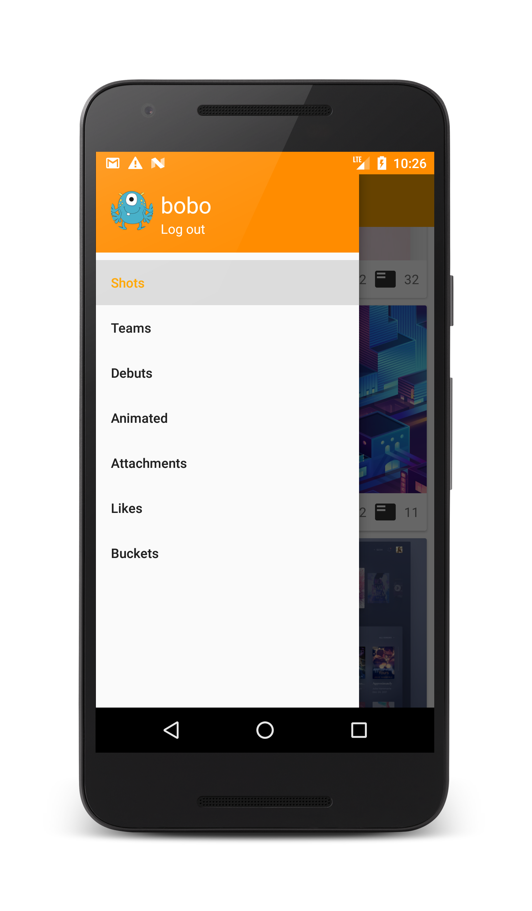
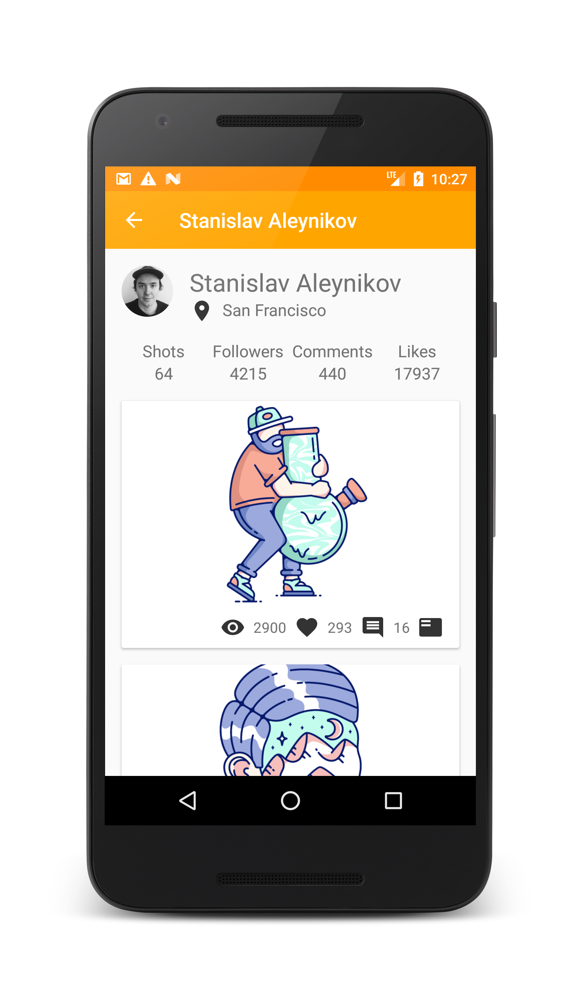
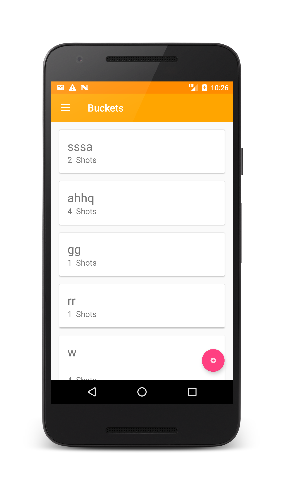
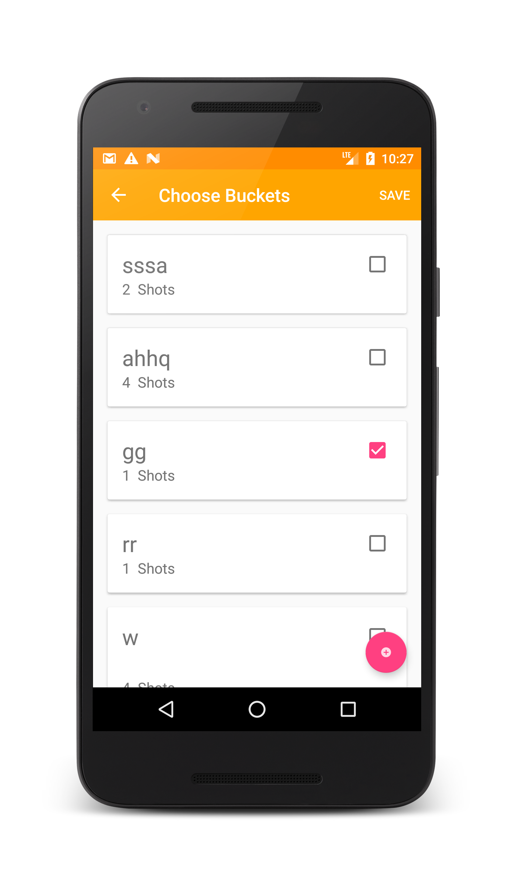

# BOBOBubble
## Description
TheBOBOBubble is an android Dribbble client app which allowed the user to view artist work and profile on Dribbble using android device. 
The all information is provided through [Dribbble API](http://developer.dribbble.com/).

## Features
* Listing all the shots
* Providing the shot profile
* Storing all the favourite shots into the relevant buckets
* Like/dislike the shot
* Presenting the artist profile and their relevant art works

## Google Play
This app is available on the [Google Play](https://play.google.com/store/apps/details?id=com.bobo.normalman.bobobubble&hl=en).

## Screenshot

